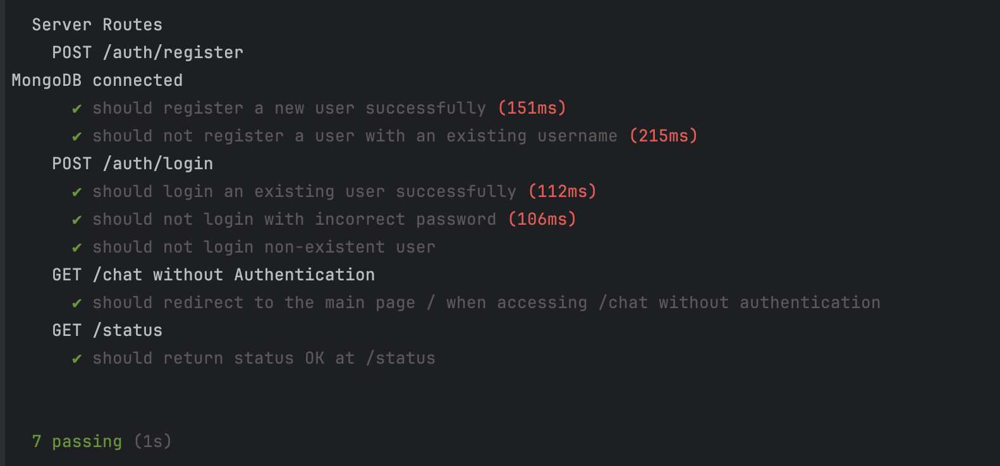

# Milestone 04 - Final Project Documentation

## NetID
**mki4895**

## Name
**Mahmoud Kassem**

## Repository Link
[GitHub Repository](https://github.com/nyu-csci-ua-0467-001-002-fall-2024/final-project-Mahmoud-K-Ismail)

## URL for Deployed Site
[Deployed Site](http://linserv1.cims.nyu.edu:31940/)

---

## Form Links

### URL for Form 1 (from previous milestone)
[Form 1](http://linserv1.cims.nyu.edu:31940/chat)

**Special Instructions for Form 1:**
- You need to register and log in to use this form.
- For simplicity, you can use the following credentials:
  - Username: `test`
  - Password: `test`
- **Usage Instructions:**
  - The name of the conversation determines the character being depicted in the chat.
  - You can edit conversation names to change the depicted character dynamically.

---

### URL for Form 2 (for current milestone)
[Form 2](http://linserv1.cims.nyu.edu:31940/chat)

**Special Instructions for Form 2:**
- This form allows editing the name of a conversation in `/chat`.
- You need to register and log in to access this form.
- For simplicity, you can use the following credentials:
  - Username: `test`
  - Password: `test`
- **Usage Instructions:**
  - While chatting, use the edit button next to a conversation to rename it.
  - The name change dynamically updates the character depicted in the chat.

---

### URL for Form 3 (from previous milestone)
[Form 3](http://linserv1.cims.nyu.edu:31940/settings)

**Special Instructions for Form 3:**
- This form allows editing the username and password.
- You need to register and log in to access this form.
- For simplicity, you can use the following credentials:
  - Username: `test`
  - Password: `test`
- **Usage Instructions:**
  - Navigate to the settings page to update your username or password.
  - Changes are saved immediately and will be reflected in subsequent logins.

---

## Code Highlights

### First Link to GitHub Line Numbers for Constructor, HOF, etc.
1. [History Mapping](https://github.com/nyu-csci-ua-0467-001-002-fall-2024/final-project-Mahmoud-K-Ismail/blob/9812b867d6b641ed78a6b970ef19f30296d04631/shakespearegpt-frontend/src/Chat.jsx#L205)

### Second Link to GitHub Line Numbers for Constructor, HOF, etc.
2. [History Update](https://github.com/nyu-csci-ua-0467-001-002-fall-2024/final-project-Mahmoud-K-Ismail/blob/9812b867d6b641ed78a6b970ef19f30296d04631/shakespearegpt-frontend/src/Chat.jsx#L304)

### Third Link to GitHub Line Numbers for Constructor, HOF, etc.
3. [Messages Mapping](https://github.com/nyu-csci-ua-0467-001-002-fall-2024/final-project-Mahmoud-K-Ismail/blob/9812b867d6b641ed78a6b970ef19f30296d04631/shakespearegpt-frontend/src/Chat.jsx#L256)

---

## Short Description for Links Above

1. **`history.map((conv) => ...)`** - Maps over the chat history to display each conversation in the sidebar, allowing users to select, edit, or delete conversations dynamically.
2. **`setHistory((prevHistory) => prevHistory.map((conv) => ...))`** - Maps over the existing history to update the name of a specific conversation when it is edited by the user.
3. **`messages.map((msg, index) => ...)`** - Maps over the messages of the active conversation to display each message in the chat window, formatting user and bot messages differently.

---

## Database Schemas

### Link to GitHub Line Numbers for Schemas
1. [User Schema](https://github.com/nyu-csci-ua-0467-001-002-fall-2024/final-project-Mahmoud-K-Ismail/blob/master/models/User.js)
2. [Conversation Schema](https://github.com/nyu-csci-ua-0467-001-002-fall-2024/final-project-Mahmoud-K-Ismail/blob/master/models/Conversation.js)

---

## Research Topics and Implementation

### Points Breakdown
- **2 points** - Implemented and modified authentication with Passport.js
- **6 points** - Built and managed forms in React with validation
- **2 points** - Deployed and managed the application using PM2
- **2 points** - Used and customized Bootstrap for UI components
- **3 points** - Wrote unit tests using Mocha and Supertest
- **2 points** - Integrated an API for chat responses

### Links to GitHub Line Numbers
1. [Passport Authentication](https://github.com/nyu-csci-ua-0467-001-002-fall-2024/final-project-Mahmoud-K-Ismail/commit/d85589ab377bf55c425f079739dee70e6c9f42d2)
2. [React Forms](https://github.com/nyu-csci-ua-0467-001-002-fall-2024/final-project-Mahmoud-K-Ismail/tree/master/shakespearegpt-frontend)
3. [Bootstrap Usage](https://github.com/nyu-csci-ua-0467-001-002-fall-2024/final-project-Mahmoud-K-Ismail/blob/master/shakespearegpt-frontend/src/App.css)
4. [Unit Tests](https://github.com/nyu-csci-ua-0467-001-002-fall-2024/final-project-Mahmoud-K-Ismail/tree/master/tests)
5. [API Integration](https://github.com/nyu-csci-ua-0467-001-002-fall-2024/final-project-Mahmoud-K-Ismail/blob/99966626a30c8a3f520c8c8d38d768b58a36a9b9/routes/chat.js#L6)

---

## Tests Passing Screenshot

Below is a screenshot of all the tests passing successfully, validating the core functionality of the project:

---

## Optional Project Notes
- Before starting to chat, edit the "Gemini Bot" placeholder conversation to any character you would like to converse with. Enjoy your experience!

---

## Attributions
1. **routes/index.js** - Authentication code based on [DigitalOcean's Passport.js tutorial](https://www.digitalocean.com/community/tutorials/how-to-add-login-authentication-to-your-application-with-express-and-passport)
2. **components/Forms.js** - React forms code referenced from [React Docs on Forms](https://reactjs.org/docs/forms.html)
3. **server.js** - Deployment and process management configured using [PM2 Quick Start](https://pm2.keymetrics.io/docs/usage/quick-start/)
4. **public/bootstrap.css** - Bootstrap styling from [Bootstrap Documentation](https://getbootstrap.com/docs/)
5. **tests/server.test.js** - Unit testing setup based on [Mocha Documentation](https://mochajs.org/)
6. **routes/chat.js** - Chat API integration adapted from [Google Generative AI Documentation](https://developers.generativeai.google/api)
