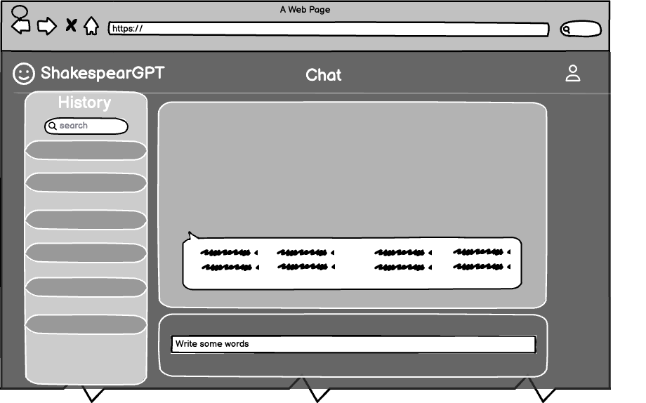
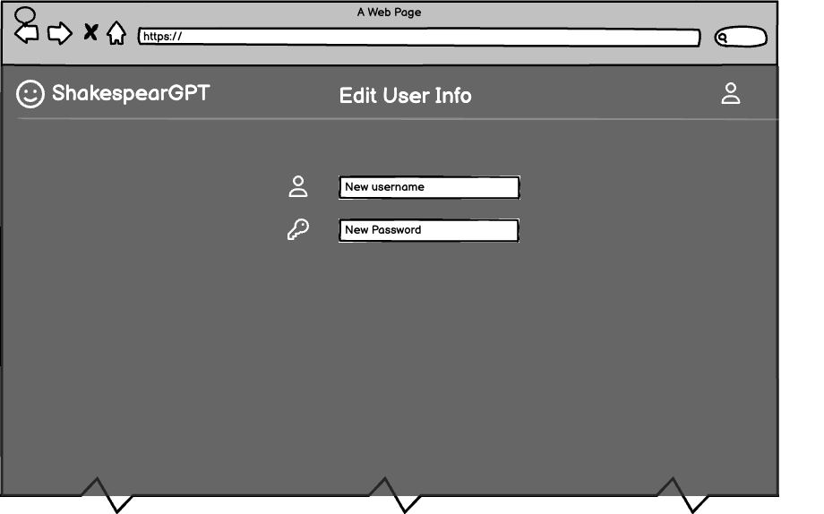
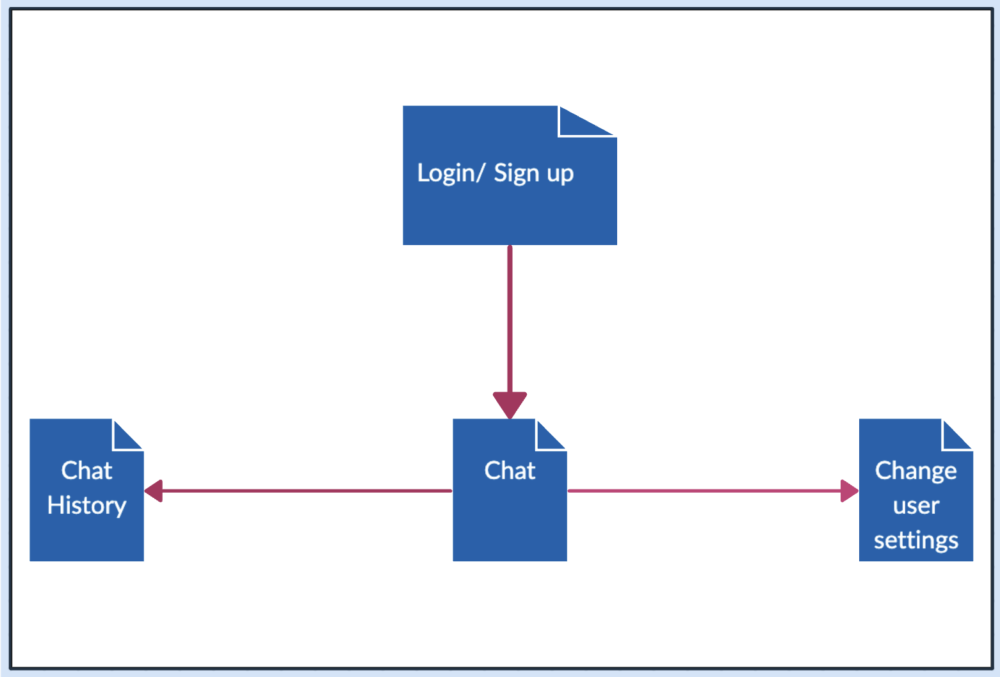
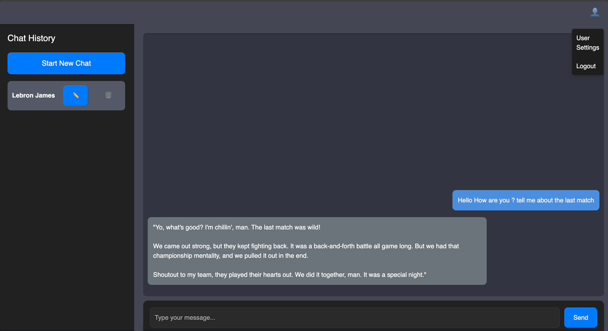
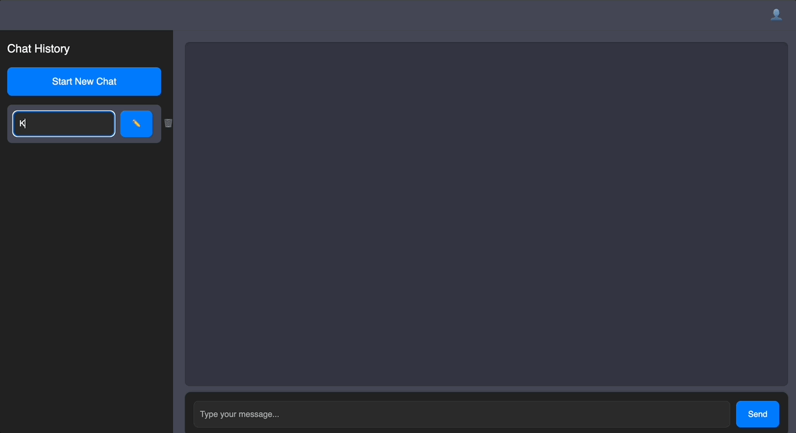

# CelebrAI

## Overview

**CelebrAI** is a fun, interactive, and educational tool that brings the styles of famous historical figures, literary characters, and philosophers to life. Engage in conversations with AI personas inspired by iconic individuals, offering a unique way to explore language, history, and literature.

With **CelebrAI**, users can:
- Register and log in securely.
- Chat with personas such as William Shakespeare, Albert Einstein, or even Hamlet.
- Customize their settings.
- Review and edit their conversation history.

This application combines entertainment and learning, making it perfect for students, educators, and enthusiasts alike!

---

## Features

- **AI-Powered Conversations:** Chat with AI personas that mimic historical and literary figures.
- **Secure User Authentication:** Protect user data with robust login and session management.
- **Customizable User Settings:** Update usernames, passwords, and other preferences.
- **Conversation History:** Review and rename chat sessions for a tailored experience.
- **Dynamic Persona Selection:** Change the persona mid-conversation for more interactive chats.

---

## Technology Stack

- **Frontend:** React.js, Bootstrap
- **Backend:** Node.js, Express.js
- **Database:** MongoDB
- **Authentication:** Passport.js
- **API Integration:** GPT-based AI response generation

---

## Wireframes

### Login Page


### Chat Interface


### Settings Page


## Website MAP


---

## Installation and Setup

### Prerequisites
- Node.js and npm installed.
- MongoDB installed and running.

### Steps
1. Clone the repository:
   ```bash
   git clone https://github.com/your-repo/CelebrAI.git
   cd CelebrAI
   ```
2. Install dependencies:
   ```bash
   npm install
   ```
3. Set up the environment:
  - Create a `.env` file in the root directory.
  - Add the following:
    ```
    PORT=3000
    SESSION_SECRET=your_secret
    MONGO_URI=mongodb://localhost:27017/celebrai
    ```
4. Start the application:
   ```bash
   npm run dev
   ```
5. Access the application at `http://localhost:3000`.

---

## Usage

1. **Register or Log In:**
  - Navigate to the `/register` or `/login` page.
  - Securely register or log in to your account.

2. **Chat with Personas:**
  - After logging in, start a chat with any persona of your choice.
  - Use the conversation editor to rename or delete chats.

3. **Update Settings:**
  - Visit `/settings` to change your username or password.

---

## Project Showcase

### How it Works
- **Login**  
  

- **Register**  
  

- **Chatting with a Persona**  
  

- **Changing Username**  
  

---

## Database Schemas

### User
```javascript
{
  username: String,
  password: String,
  conversations: [ObjectId] // References to Conversation documents
}
```

### Conversation
```javascript
{
  user: ObjectId, // Reference to User
  persona: String, // Selected persona for the conversation
  messages: [
    { content: String, isUser: Boolean, timestamp: Date }
  ]
}
```

---

## Testing

- Unit tests for backend routes and authentication logic are available in the `tests/` directory.
- Run tests using:
  ```bash
  npm test
  ```

---

## Contributing

We welcome contributions! To contribute:
1. Fork the repository.
2. Create a feature branch:
   ```bash
   git checkout -b feature/your-feature
   ```
3. Commit and push your changes.
4. Open a pull request.

---

## License

This project is licensed under the MIT License. However, **permission is required** to edit or use this code.

---

## Authors

**Mahmoud Kassem**
- [GitHub Repository](https://github.com/nyu-csci-ua-0467-001-002-fall-2024/final-project-Mahmoud-K-Ismail)
- [Deployed Site](http://linserv1.cims.nyu.edu:31940/)

