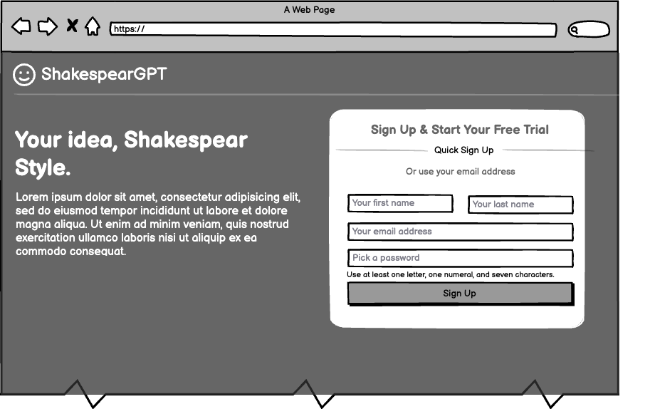
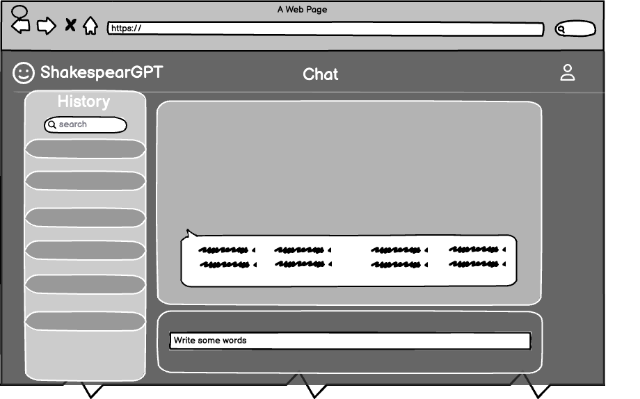
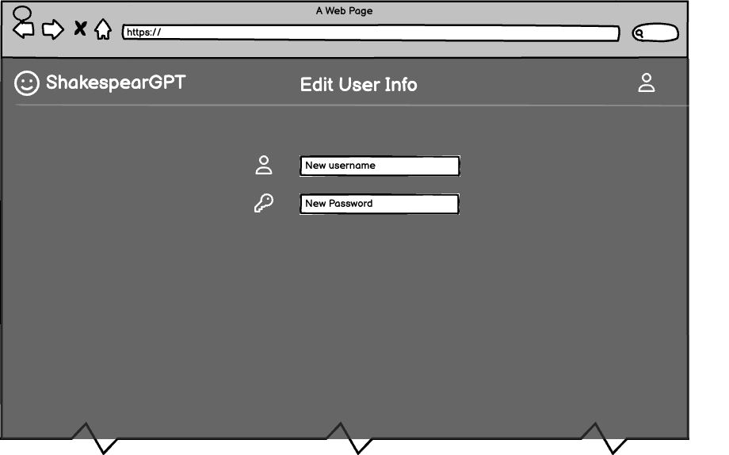

[//]: # (The content below is an example project proposal / requirements document. Replace the text below the lines marked "__TODO__" with details specific to your project. Remove the "TODO" lines.)

[//]: # ()
[//]: # (&#40;___TODO__: your project name_&#41;)

[//]: # ()
[//]: # (# Shoppy Shoperson )

[//]: # ()
[//]: # (## Overview)

[//]: # ()
[//]: # (&#40;___TODO__: a brief one or two paragraph, high-level description of your project_&#41;)

[//]: # ()
[//]: # (Remembering what to buy at the grocery store is waaaaay too difficult. Also, shopping for groceries when you're hungry leads to regrettable purchases. Sooo... that's where Shoppy Shoperson comes in!)

[//]: # ()
[//]: # (Shoppy Shoperson is a web app that will allow users to keep track of multiple grocery lists. Users can register and login. Once they're logged in, they can create or view their grocery list. For every list that they have, they can add items to the list or cross off items.)

[//]: # ()
[//]: # ()
[//]: # (## Data Model)

[//]: # ()
[//]: # (&#40;___TODO__: a description of your application's data and their relationships to each other_&#41; )

[//]: # ()
[//]: # (The application will store Users, Lists and Items)

[//]: # ()
[//]: # (* users can have multiple lists &#40;via references&#41;)

[//]: # (* each list can have multiple items &#40;by embedding&#41;)

[//]: # ()
[//]: # (&#40;___TODO__: sample documents_&#41;)

[//]: # ()
[//]: # (An Example User:)

[//]: # ()
[//]: # (```javascript)

[//]: # ({)

[//]: # (  username: "shannonshopper",)

[//]: # (  hash: // a password hash,)

[//]: # (  lists: // an array of references to List documents)

[//]: # (})

[//]: # (```)

[//]: # ()
[//]: # (An Example List with Embedded Items:)

[//]: # ()
[//]: # (```javascript)

[//]: # ({)

[//]: # (  user: // a reference to a User object)

[//]: # (  name: "Breakfast foods",)

[//]: # (  items: [)

[//]: # (    { name: "pancakes", quantity: "9876", checked: false},)

[//]: # (    { name: "ramen", quantity: "2", checked: true},)

[//]: # (  ],)

[//]: # (  createdAt: // timestamp)

[//]: # (})

[//]: # (```)

[//]: # ()
[//]: # ()
[//]: # (## [Link to Commented First Draft Schema]&#40;db.js&#41; )

[//]: # ()
[//]: # (&#40;___TODO__: create a first draft of your Schemas in db.js and link to it_&#41;)

[//]: # ()
[//]: # (## Wireframes)

[//]: # ()
[//]: # (&#40;___TODO__: wireframes for all of the pages on your site; they can be as simple as photos of drawings or you can use a tool like Balsamiq, Omnigraffle, etc._&#41;)

[//]: # ()
[//]: # (/list/create - page for creating a new shopping list)

[//]: # ()
[//]: # (![list create]&#40;documentation/list-create.png&#41;)

[//]: # ()
[//]: # (/list - page for showing all shopping lists)

[//]: # ()
[//]: # (![list]&#40;documentation/list.png&#41;)

[//]: # ()
[//]: # (/list/slug - page for showing specific shopping list)

[//]: # ()
[//]: # (![list]&#40;documentation/list-slug.png&#41;)

[//]: # ()
[//]: # (## Site map)

[//]: # ()
[//]: # (&#40;___TODO__: draw out a site map that shows how pages are related to each other_&#41;)

[//]: # ()
[//]: # (Here's a [complex example from wikipedia]&#40;https://upload.wikimedia.org/wikipedia/commons/2/20/Sitemap_google.jpg&#41;, but you can create one without the screenshots, drop shadows, etc. ... just names of pages and where they flow to.)

[//]: # ()
[//]: # (## User Stories or Use Cases)

[//]: # ()
[//]: # (&#40;___TODO__: write out how your application will be used through [user stories]&#40;http://en.wikipedia.org/wiki/User_story#Format&#41; and / or [use cases]&#40;https://www.mongodb.com/download-center?jmp=docs&_ga=1.47552679.1838903181.1489282706#previous&#41;_&#41;)

[//]: # ()
[//]: # (1. as non-registered user, I can register a new account with the site)

[//]: # (2. as a user, I can log in to the site)

[//]: # (3. as a user, I can create a new grocery list)

[//]: # (4. as a user, I can view all of the grocery lists I've created in a single list)

[//]: # (5. as a user, I can add items to an existing grocery list)

[//]: # (6. as a user, I can cross off items in an existing grocery list)

[//]: # ()
[//]: # (## Research Topics)

[//]: # ()
[//]: # (&#40;___TODO__: the research topics that you're planning on working on along with their point values... and the total points of research topics listed_&#41;)

[//]: # ()
[//]: # (* &#40;5 points&#41; Integrate user authentication)

[//]: # (    * I'm going to be using passport for user authentication)

[//]: # (    * And account has been made for testing; I'll email you the password)

[//]: # (    * see <code>cs.nyu.edu/~jversoza/ait-final/register</code> for register page)

[//]: # (    * see <code>cs.nyu.edu/~jversoza/ait-final/login</code> for login page)

[//]: # (* &#40;4 points&#41; Perform client side form validation using a JavaScript library)

[//]: # (    * see <code>cs.nyu.edu/~jversoza/ait-final/my-form</code>)

[//]: # (    * if you put in a number that's greater than 5, an error message will appear in the dom)

[//]: # (* &#40;5 points&#41; vue.js)

[//]: # (    * used vue.js as the frontend framework; it's a challenging library to learn, so I've assigned it 5 points)

[//]: # ()
[//]: # (10 points total out of 8 required points &#40;___TODO__: addtional points will __not__ count for extra credit_&#41;)

[//]: # ()
[//]: # ()
[//]: # (## [Link to Initial Main Project File]&#40;app.js&#41; )

[//]: # ()
[//]: # (&#40;___TODO__: create a skeleton Express application with a package.json, app.js, views folder, etc. ... and link to your initial app.js_&#41;)

[//]: # ()
[//]: # (## Annotations / References Used)

[//]: # ()
[//]: # (&#40;___TODO__: list any tutorials/references/etc. that you've based your code off of_&#41;)

[//]: # ()
[//]: # (1. [passport.js authentication docs]&#40;http://passportjs.org/docs&#41; - &#40;add link to source code that was based on this&#41;)

[//]: # (2. [tutorial on vue.js]&#40;https://vuejs.org/v2/guide/&#41; - &#40;add link to source code that was based on this&#41;)

# ShakespeareGPT

## Overview

ShakespeareGPT is a web application that allows users to engage in conversations in the style of William Shakespeare. Users can input text, and the application will generate responses mimicking Shakespeare's unique writing style. This project aims to provide an entertaining and educational experience for literature enthusiasts, students, and anyone interested in Shakespearean language.

The application uses a machine learning model trained on Shakespeare's works to generate responses. Users can create accounts, save their favorite conversations, and even choose different Shakespearean characters to converse with.

## Data Model

The application will store Users, Conversations, and Messages:

- **Users** can have multiple conversations (via references).
- Each **conversation** can have multiple messages (by embedding).

### Example User
```javascript
{
  username: "bardlover123",
  hash: // a password hash,
  conversations: // an array of references to Conversation documents
}
```

### Example Conversation with Embedded Messages
```javascript
{
  user: // a reference to a User object,
  character: "Hamlet",
  messages: [
    { 
      content: "To be, or not to be, that is the question:",
      isUser: false,
      timestamp: // timestamp
    },
    {
      content: "What's troubling you, good Hamlet?",
      isUser: true,
      timestamp: // timestamp
    }
  ],
  createdAt: // timestamp
}
```

## [Link to Commented First Draft Schema](db.js)

## Wireframes

- **/login** - Page for logging in or registering  
  

- **/chat** - Main page for chatting with Shakespeare  
  

- **/user info editing** - Page for editing user info
  

## Site Map

Site map

## User Stories or Use Cases

1. As a non-registered user, I can register a new account with the site.
2. As a user, I can log in to the site.
3. As a user, I can start a new conversation with a Shakespearean character.
4. As a user, I can view my conversation history.
5. As a user, I can continue a previous conversation.
6. As a user, I can choose different Shakespearean characters to converse with.

## Research Topics

- (5 points) Integrate user authentication
  - I'm going to be using Passport for user authentication.
  - I will also implement OAuth 2.0 using Google Sign-In.

- (3 points) Use a CSS framework throughout your site with reasonable customization.
  - I plan to use Tailwind CSS for styling the application.

- (4 points) Perform client-side form validation using custom JavaScript or a library.
  - Implement form validation for user registration and message input.

- (5 points) Machine Learning Integration
  - Integrate a model that is devoloped using LSTM (Long-Short term Memory) deep learning method which is trained on Shakespear works. 

**Total Points:** 17 out of 8 required points.

## [Link to Initial Main Project File](app.mjs)

## Annotations / References Used

1. [Passport.js Authentication Docs](http://passportjs.org/docs) - (add link to source code that was based on this)
2. [Tailwind CSS Documentation](https://tailwindcss.com/docs) - (add link to source code that was based on this)
3. [HuggingFace Transformers Library](https://huggingface.co/transformers/) - (add link to source code that was based on this)
4. [Express.js Documentation](https://expressjs.com/) - (add link to source code that was based on this)
